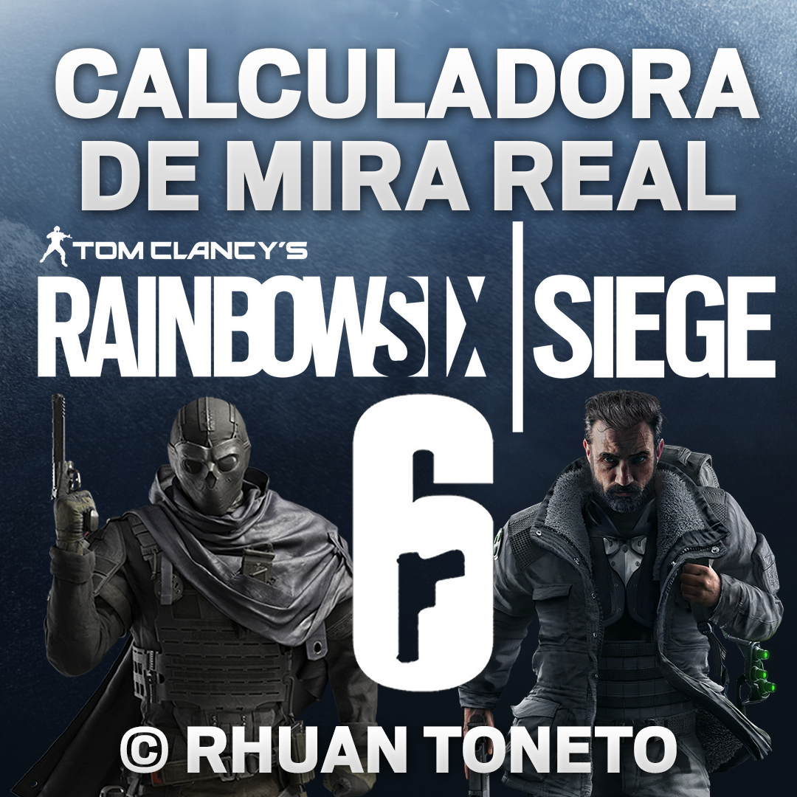
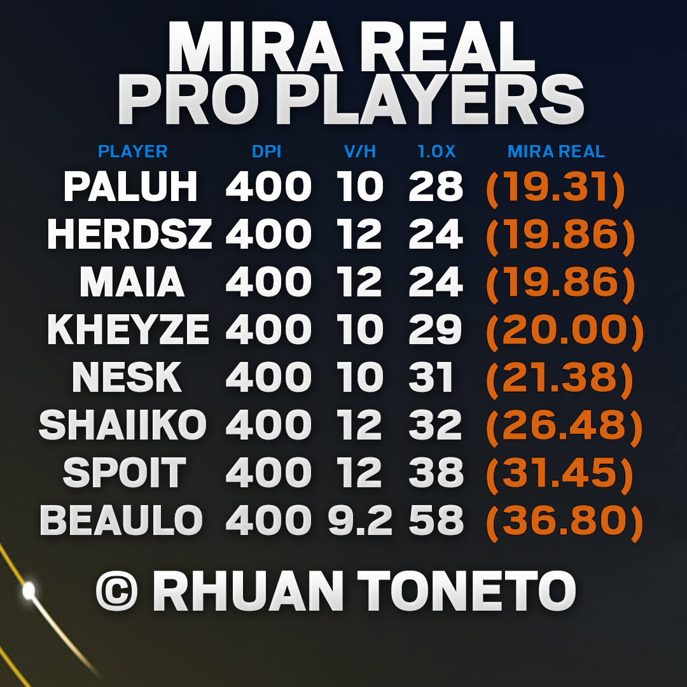

## Calculadora de Mira Real para Rainbow Six Siege

Olá, operadores! 🖱️💻🎮

Alguma vez você já copiou a sensibilidade de um jogador profissional, esperando que sua mira ficasse tão precisa quanto a dele? E, bem... como isso funcionou para você? 😅 Já ficou trocando de sensibilidade a cada pinada? Já tentou manter a mesma mira mudando de DPI ou ajustando a sensibilidade vertical/horizontal, mas acabou ficando mais rápido, mais lento, e a precisão... bem, vamos dizer que não estava lá essas coisas?

Se você se identificou com alguma dessas situações, tenho a solução perfeita para você: a **Calculadora de Mira Real**. A verdade é que copiar a configuração de outra pessoa nunca dá certo. Então, que tal encontrar a **SUA** mira perfeita, fazendo ajustes finos nas configurações que afetam a sua sensibilidade? 😎

|  |  |
|:-------------------------------------:|:-------------------------------------:|

Vale lembrar que as sensibilidades desses proplayers podem já ter mudado, pois eles costumam ajustá-las de vez em quando. Então, é um pouco difícil manter tudo atualizado, mas ainda assim, dá para ter ideia de uma sensibilidade média entre eles.

De acordo com uma média coletada pelo site ProSettings.net, os balosos do Siege - aqueles com as miras mais precisas e que fazem muitas eliminações - têm uma Mira Real que varia entre **19** e **37**. Que tal usar essa média como ponto de partida para encontrar a sua mira perfeita? E calma, não estou dizendo para você copiar esses números! Afinal, cada jogador é único e a sensibilidade perfeita para você é aquela com a qual você se sente confortável. Então, sinta-se à vontade para usar a sensibilidade que quiser. Cada jogador tem a sua, e tá tudo bem! 🤗

## Como usar? 🤔

1. Insira o DPI do Mouse.
2. Insira a Sensibilidade Vertical/Horizontal.
3. Altere o Multiplicador somente se você modificou o valor padrão.
4. Insira a Sensibilidade da Mira 1.0x.
5. Clique no botão "Calcular".

E pronto! ✅

Chegou o momento de brilhar, carregar seu Squad nas costas, realizar aquele 5K Clutch e alcançar o tão almejado e sonhado Champion! 🏆
[Clique aqui](https://rhuantoneto.github.io/R6CalculadoraMiraReal/) para usar a Calculadora de Mira Real agora mesmo!

Espero que isso ajude! Boa sorte e bom jogo! GL HF ✌️

"Considere isso aprendizado." - Sam "Zero" Fisher

## Aviso Importante

Esta ferramenta não é afiliada ou endossada pela Ubisoft ou pela equipe de desenvolvimento do Tom Clancy's Rainbow Six Siege. É um projeto independente criado para fins educacionais e analíticos.

Além disso, devido a uma variedade de fatores, incluindo diferenças individuais em hardware e preferências pessoais, a "Calculadora de Mira Real" pode não fornecer resultados 100% precisos para todos os usuários. As diferenças no hardware, como o tipo de mouse ou a capacidade do PC para atingir altas taxas de frames, podem influenciar os resultados. Além disso, as preferências pessoais, como o campo de visão (FOV), resolução, proporção, configurações de aceleração do mouse e do Windows, e o tipo de MousePad, também podem afetar a precisão.

## Contribuindo

Este projeto é um trabalho em andamento e estou aberto a sugestões e correções para melhorá-lo. Se você tiver alguma ideia ou encontrar algum problema, por favor, não hesite em compartilhar.
